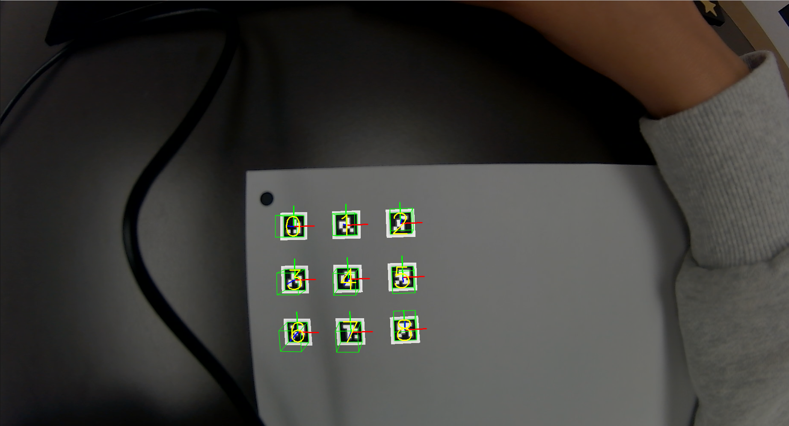
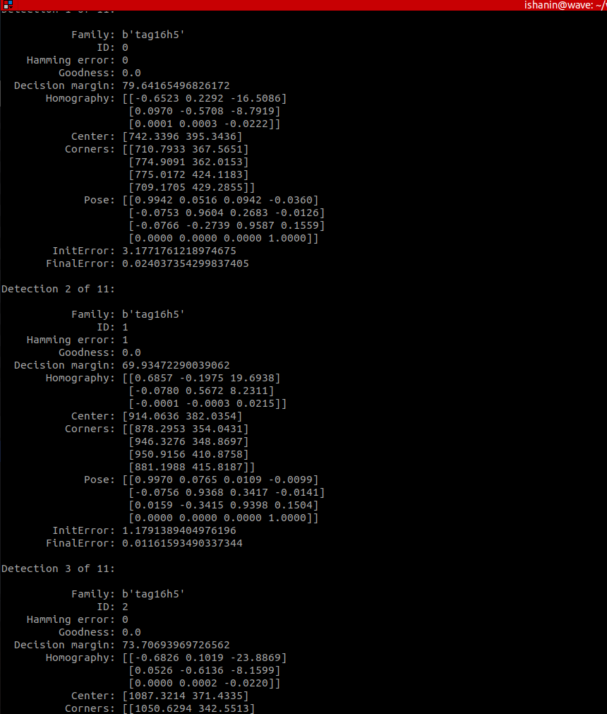

# Sealbot
Python and C++ scripts adjusting April Tag Tracking library to work underwater on 10mmx10mm april tags. 

## Background Information
This project tracks the 3D pose of 10x10mm tags underwater using a monocular camera. The april tags are connected to soft robotic bio-inspired whiskers that move as the underwater ROV moves. The purpose of this code is to accurately track the 3D pose change of these whiskers over time in order to calculate information such as self-speed or external disturbances in the water.

For more information about the seal-inspired robotic platform and the development of the seal whisker sensors, visit: https://ishani-narwankar.github.io/projects/01-sealrobot

The code in this repository has been inspired and developed from the 3D Pose Tracking Library you can find here: https://github.com/Tinker-Twins/AprilTag

## **How To Run**
In order to run the code on a input image, `cd` into scripts: 

`python3 ./apriltag_image.py ../media/input/[insert image here]`

In order to run the code on an input video, `cd` into scripts:

`python3 ./apriltag_video.py ../media/input/[insert video here]`

## **Testing Camera Parameters**
After camera calibration, make sure you have adjusted the camera params and tag_family sections of the scripts to match your setup.

You should then be able to run the code (as stated above) on some test images of your tags. The output should look as follows:

  

  

 
